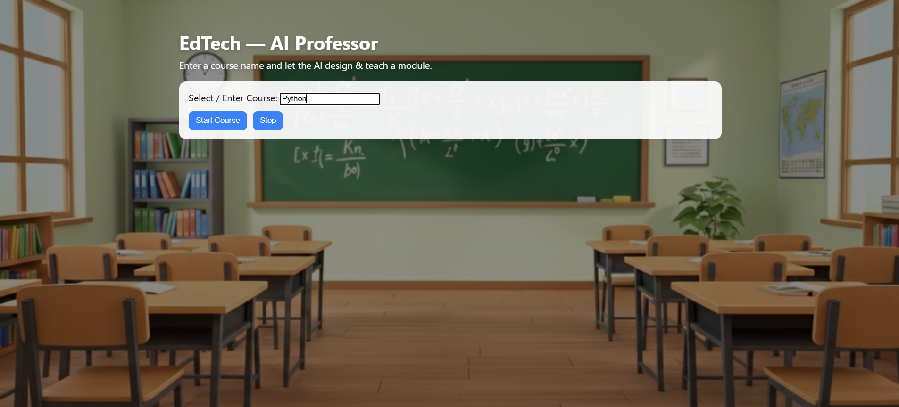
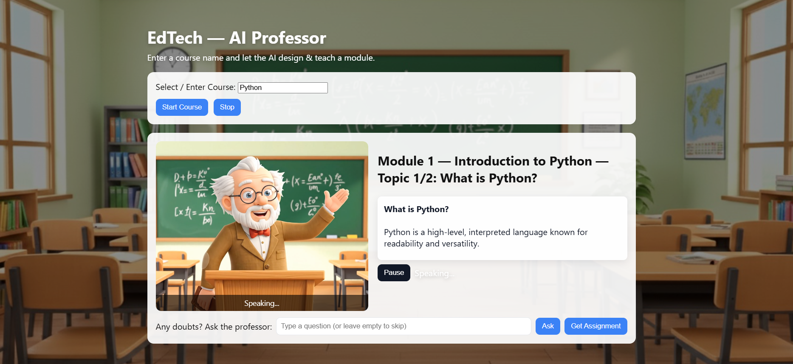
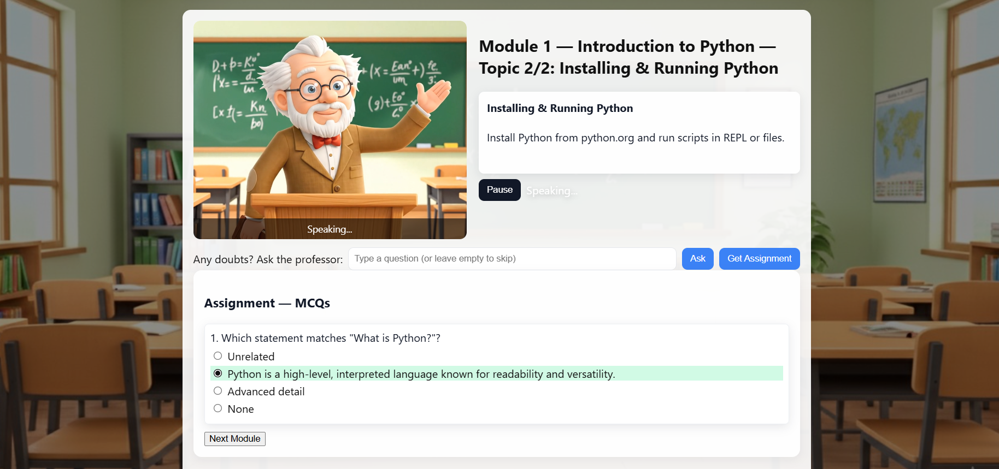
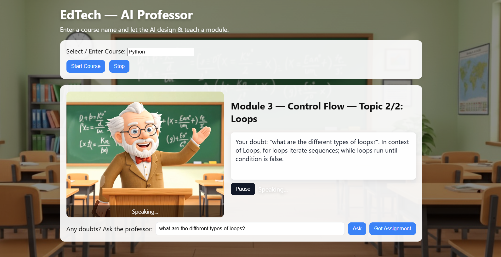
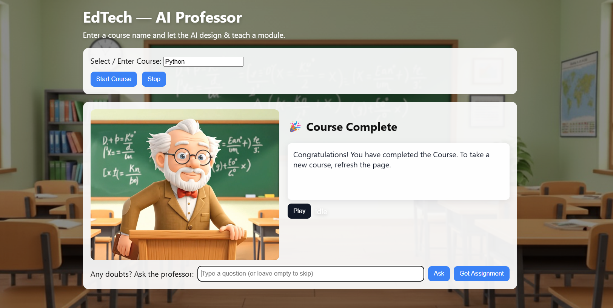

# 🎓EdTech AI-Professor

An educational platform to learn courses which are created, designed, and taught by AI Professor. (Prototype)

## 🚀 Features

### -  Course Selection
  - Enter a course name (Python, Java, or Web Development) to start learning.
### - AI Professor Simulation
  - Plays a looping professor video (professor.mp4) while speaking.
  - Uses browser text-to-speech for lecture delivery.
### - Dynamic Course Modules
  - Predefined outlines for Python, Java, and Web Development.
  - Each module contains topics with explanations.
### - Interactive Learning
  - Doubt section: Ask questions during lectures.
  - MCQ-based assignments generated at the end of each module.
  - Correct/Incorrect answers are spoken aloud with explanations.
### - Course Progression
  - Complete modules sequentially.
  - Final message on course completion.
### - Responsive Design
  - Background image overlay (background.jpg) for readability.
  - Modern, card-based UI with styles.css.

## 🛠️ Tech Stack

- Frontend: HTML5, CSS3, JavaScript (Vanilla)
- Video & Speech: HTML <video> + Browser Speech Synthesis API
- Dynamic Content: JavaScript course generation and MCQ rendering

## 📂 Project Structure

```
├── index.html       # Main interface (UI for the AI professor)
├── styles.css       # Styling and background theme
├── script.js        # Core logic (courses, doubts, MCQs, speech, flow)
├── professor.mp4    # Virtual professor video loop
└── background.jpg   # Background image
```

## 🎮 How to Run

1. Clone the repository:
```
git clone https://github.com/your-username/your-repo-name.git
cd your-repo-name
```
2. Open index.html in a browser.
3. Enter a course name (e.g., Python, Java, Web Development).
4. Click Start Course to begin learning with the AI professor.

## 🌍 Live Demo

[Learn Course](https://rithvik0906.github.io/EdTech_AI-Professor/)

## 📸 Screenshots







## 🌟 Future Enhancements

- Add more courses and detailed module generation.
- Improve speech with neural TTS APIs.
- Store student progress and results.
